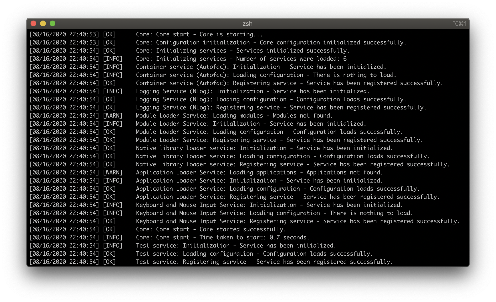

##   Waves Core

/statusIcon)  

### 📚 About Waves

**Waves** is a small cross-platform framework designed for flexible developing of desktop applications. Its ideology was created by one developer for 3 years and hopes to find support in the community. Enjoy!


### 📒 About Waves.Core

**Waves.Core** is base kernel of Waves framework. It contains interfaces, base primitives, abstractions, services and utilities of framework. Base services include container service based on Autofac, logging service based on NLog, service for input messages and service for loading native assemblies. 


### 🚀 Getting started

Like all Waves libraries Waves.Core distributes via **NuGet**. You can find the packages [here](https://www.nuget.org/profiles/Waves).

Or use these commands in the Package Manager to install Waves.Core manually:

```
Install-Package Waves.Core
```


### ⌨️ Usage basics

After installing the package you just need to declare new instance of a core and start it.

```c#
var core = new Core();
core.Start();
```

Output will be look like this:



To stop the core type:

```c#
core.Stop();
```


### 📜 Logging

In framework logging service implemented from **ILoggingService**, and use **NLog** as default. But you can use other logging library if you develop it.

For inner messages Waves using objects implented from IMessage. They also used for logging. For example:

```c#
core.WriteLog(new Message("Test title", 
                "Test message.", 
                "Sender name",
                MessageType.Information));
```

You can also write text only to log:

```c#
core.WriteLog("Test");
```

And you can write exception:

```c#
core.WriteLog(new Exception("Test exception message"), 
              "Sender name", 
              false);
```


### 📦 Container

Container service implemented from **IContainerService**, and use **Autofac** as default. Like other services, you can implented you own Container service.

With container you can easily register services and other objects. All of compiled service registering automatically if they if marked with an attribute **[Export(typeof(IService))]**, for example:

```c#
[Export(typeof(IService))]
public class Service : Base.Service, ITestService
{
	// put you service code hear.
}
```

For convenience, the service can be inherited from the **Wave.Core.Service** abstract class.  

If you want to register new service just on runtime just type:

```c#
core.RegisterInstance<ITestService>(new TestService());
```

To resolve service type:

```c#
var service = core.GetInstance<ITestService>();
```


### 📋 Licence

Waves.Core is licenced under the [MIT licence](https://github.com/ambertape/waves.core/blob/master/license.md).
